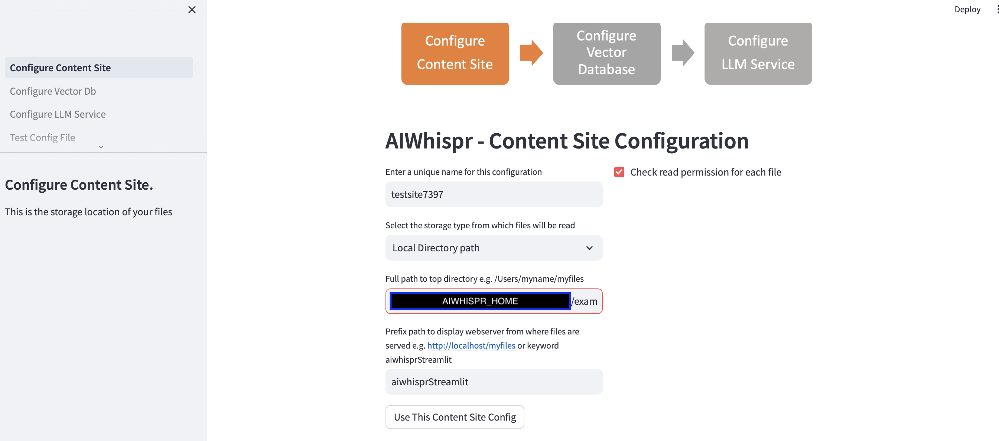
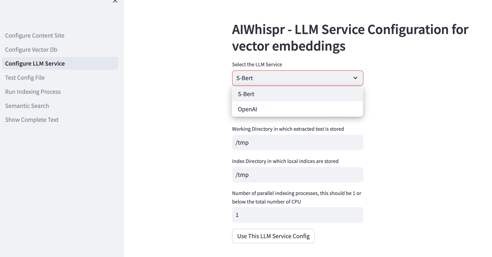
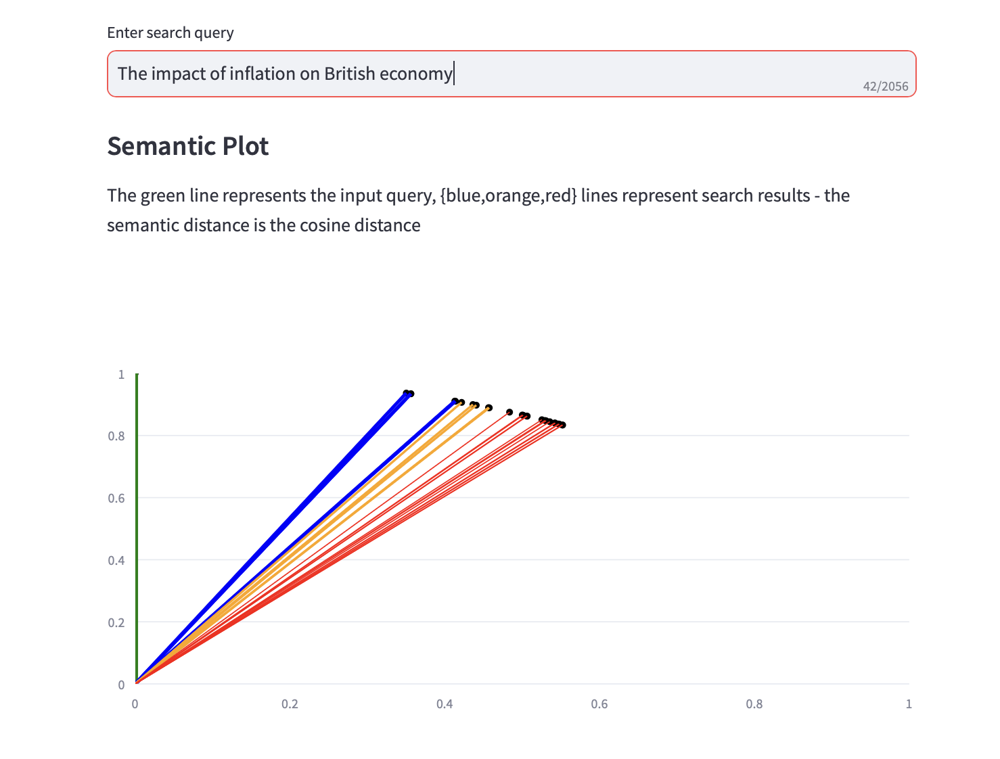
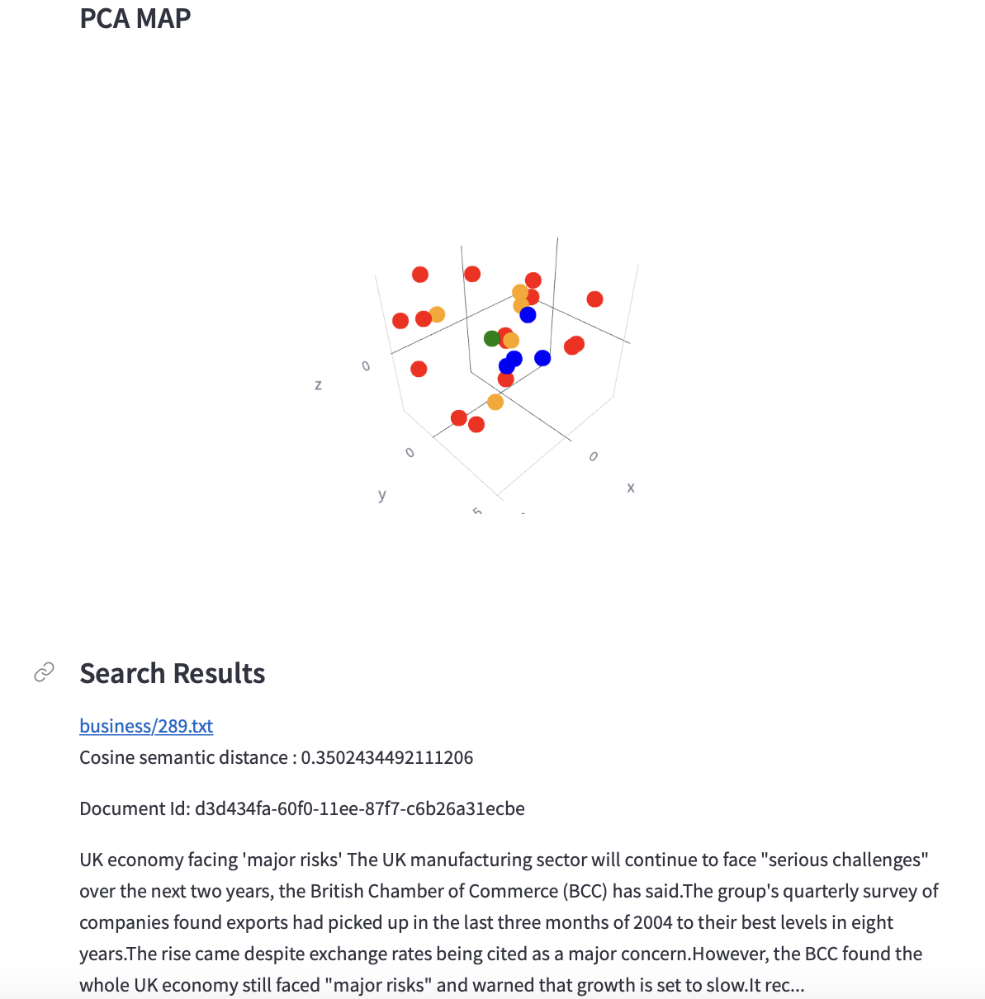

# AIWhispr

## Overview
AIWhispr is a no/low code tool to automate vector embedding pipelines for semantic search. 
It drives the pipeline for reading files, extracting text, creating vector embeddings and storing it in a vector database using simple configurations.

AIWhispr
- is easy to install.
- simple to configure.
- delivers fast semantic response to search queries.
- can handle multiple file formats (txt,csv, pdf, docx,pptx, docx) stored on AWS S3, Azure Blob Containers,Google Cloud Storage, local directory path.
- supports multiple vector databases (Qdrant,Weaviate,Milvus,Typesense) 


## Contact
contact@aiwhispr.com

## Setting up your environment after cloning AIWhispr from github 

### Install and start your vector database

AIWhispr has connectors for the following vector databases 

1\ Qdrant

2\ Milvus

3\ Weaviate

4\ Typesense 

Please  ensure that you have installed and started your vector database. 

### Environment variables
AIWHISPR_HOME_DIR environment variable should be the full path to aiwhispr directory.

AIWHISPR_LOG_LEVEL environment variable can be set to  DEBUG / INFO / WARNING / ERROR
```
AIWHISPR_HOME=/<...>/aiwhispr
AIWHISPR_LOG_LEVEL=DEBUG
export AIWHISPR_HOME
export AIWHISPR_LOG_LEVEL
```
**Remember to add the environment variables in your shell login script**

### Install Python packages 
Run the below command
```
$AIWHISPR_HOME/shell/install_python_packages.sh
```
If uwsgi install is failing then ensure you have gcc, python-dev , python3-dev installed.
```
sudo apt-get install gcc 
sudo apt install python-dev
sudo apt install python3-dev
pip3 install uwsgi
```

## Using Streamlit app to configure, index, search 

AIWhispr comes with a streamlit app to help you get started.

Run the streamlit app 
```
cd $AIWHISPR_HOME/python/streamlit
streamlit run ./Configure_Content_Site.py &
```

This should start a streamlit app on the default port 8501 and  start a session on your web browser

There are 3 steps to configure the pipeline for indexing your content for semantic search. 

- Configure Content Sites : Provide details of the storage location that hosts your content (files).
- Configure Vector DB : Provide connection details of your Vector DB in which the vector embeddings of your content will be stored.
- Configure LLM Service : Provide the large language model details (SBert/OpenAI) which will be used to encode your content into vector embeddings. 

**1. Configuration to reading files from a storage location**



You can continue with the default configuration by clicking on the button 
"Use this Content Site Config"

and move to the next step to configure vector database connection.

The default example will index over news stories from BBC for semantic search.

The streamlit app assumes that you are starting a new configuration and will 
assign a random configuration name. You can overwrite this to give it a more 
meaningful name. The configuration name should be unique and not contain whitespace or special characters.

The default configuration will read content from the local directory path 
$AIWHISPR_HOME/examples/http/bbc 

This contains over 2000+ news stories from BBC which are indexed for semantic search.

You can choose to read content stored on AWS S3, Azure Blob, Google Cloud Storage.

The prefix path configuration is used to create the href web links for the search results.
You can continue with the default keyword "aiwhisprStreamlit"

Click on the button "Use this Content Site Config" and procced to the next step to configure vector database connection by clicking on "Configure Vector Db" in the left sidebar.

**2. Configure Vector Db**


Choose your vectordb and provide the connection details.

When you choose the vector databe, the Vector Db IP address and Port numbers are populated based on the default installations.
You can change this based on your setup.

Your vector database should be configured for authentications. In the case of Qdrant, Weaviate, Typesense an API Key is required.
For Milvus a user-id , password combination is provided.

The vector dimension size should be specified based on the LLM you plan to use. 
Example: for Open AI "text-embedding-ada-002" this should be configured as 1536, which is the size of the vector returned by  OpenAI embedding service.

The default collection name created in the vector database is aiwhisprContentChunkMap. You can specify your own collection name.

Click on the button "Use This Vector Db Config" and then move to the next step by clicking on "Configure LLM Service" in the left sidebar.

**3. Configure  LLM Service**



You can choose to create vector embeddings using [Sbert](https://www.sbert.net/docs/pretrained_models.html) pretrained models that are run locally or use OpenAI API.

For SBert model family, the default model used is all-mpnet-base-v2. You can specify another SBert model.

For OpenAI the default embedding model is text-embedding-ada-002

The default working directory is /tmp 

The working-directory is the location on the local machine which will be used as a working directory to process the files that are read/downloaded from your storage location.
The extracted text from your documents is then chunked into smaller size , usually 700 words, which is then encoded as vector embeddings.
The working-dir is used to store the text chunks.

The default local indexing directory is /tmp

You can specify a persistent local directory path for working and index directory.

The index-dir is used to store the indexing list of content files that have to be read.
AIWhispr supports multiple processes for indexing , each process will use its own indexing list thereby allowing you to leverage multiple CPU's on your machine.

If you want to leverage multiple CPU's for indexing(reading content, create vector embedding, store in vector database) then specify this in the test box for number of parallel processes.
Our recommendation is that this should be 1 or max ( Number of CPU's/ 2). Example on a 8 CPU machine this should be set to 4.
AIWHispr used multiprocessing to bypass the Python GIL limitations.

Click on "Use This LLM Service Config"  to create the final version of your vector embedding pipeline configuration file.

The contents of the configuration file and its location on your machine will be displayed.

You can test this configuration by clicking on "Test Config File" in the left sidebar.


**4. Test Configuration**

You should now see a message that shows the location of your vector embedding pipeline configuration file and a button "Test Configfile"

Clicking on the button will start the process which will test the pipeline configuration for 
- connecting to the storage location
- connecting to the vector database
- encoding a sample query using the LLM Service

You should see "NO ERRORS" message at the end of the logs which informs you that this pipeline configuration can be used. 

Click on "Run Indexing process" in the left sidebar to start the pipeline.

**5. Run Indexing Process**

You should see a "Start Indexing" button.

Click on this button to start the pipeline. The logs are updated every 15 seconds. 

The default indexing processing using the example of 2000+ BBC news stories takes approximately 20 minutes.

Don't navigate away from this page while the indexing process is running i.e. while the Streamlit "Running" status is displayed on the top right.

You can also check if the indexing process is running using grep on your machine.

```
ps -ef | grep python3 | grep index_content_site.py 
```

**6. Semantic Search**

You can now run semantic search queries. 

A semantic plot that displays the cosine distance, and a top 3 PCA analysis, for the search results is also displayed alongwith the text search results..






