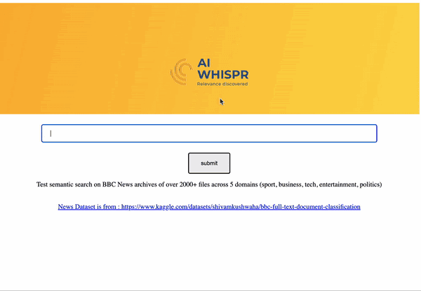

# AIWhispr

## Overview
AIWhispr is a tool to enable AI powered semantic search on documents 
- It is easy to install.
- Simple to configure.
- Can handle multiple file formats (txt,csv, pdf, docx,pptx, docx) stored on AWS S3, Azure Blob Containers, local directory path.
- Delivers fast semantic response to search queries.



## Contact
contact@aiwhispr.com

## Prerequisites for Mac OS Install 

### Download Typesense and install
AIWhispr uses Typesense to store text, corresponding vector embeddings created by the LLM.
A big Thanks!! to the Typesense team, community. You can follow the installation instructions - 
 
https://typesense.org/docs/guide/install-typesense.html

Store the "api-key" value from the typesense configuration file ( On MacOS /opt/homebrew/etc/typesense/typesense.ini )

You will need this later to configure the AIWhispr service.

### Install uwsgi
```
brew install uwsgi
```

### Python packages
Install python packages - setuptools , wheel, spacy, sentence-transformer
```
pip3 install -U pip setuptools wheel
pip3 install -U spacy
python -m spacy download en_core_web_sm
pip3 install spacy-language-detection
pip3 install -U sentence-transformers
```
Install python packages for vector database (typesense) and cloud storage 
```
pip3 install typesense
pip3 install azure-storage-blob 
pip3 install azure-identity
pip3 install boto3 
```

Install python packages for text extraction
```
pip3 install pytest-shutil
pip3 install pypdf
pip3 install textract
```

Install python packages for flask, uwsgi  which will be used for the web service
``` 
pip3 install flask
pip3 install uwsgi
``` 

pip wsgi installation could fail if you have  anaconda3 installed. Its default lib does not contain "libpython"
You can create a soft link similar to below

```
cd ~/anaconda3/lib/python3.11/config-3.11-darwin
bash-3.2$ ln -s /Library/Frameworks/Python.framework/Versions/3.11/lib/python3.11/config-3.11-darwin/libpython3.11.a ./libpython3.11.a 
```
then retry installing uwsgi python package


### Environment variables
AIWHISPR_HOME_DIR environment variable should be the full path to aiwhispr directory.

AIWHISPR_LOG_LEVEL environment variable can be set to  DEBUG / INFO / WARNING / ERROR
```
AIWHISPR_HOME=/<...>/aiwhispr
AIWHISPR_LOG_LEVEL=DEBUG
export AIWHISPR_HOME
export AIWHISPR_LOG_LEVEL
```

**Remember to add the environment variables in your shell login script**

## Your first setup
AIWhispr package comes with sample data, nginx configuration, index.html for nginx setup , python (flask)and wsgi script to help you get started.

**1. Configuration file**

A configuration file is maintained under $AIWHISPR_HOME/config/content-site/sites-available directory. 

You can use the example_bbc.filepath.macos.cfg to try your first configuration.
```
[content-site]
sitename=example_bbc.filepath
srctype=filepath
#Assuming that you have copied the $AIWHISPR_HOME/examples/bbc under your Webserver's root directory
srcpath=/opt/homebrew/var/www/bbc
#Remember to change the hostname if it's internet facing
displaypath=http://127.0.0.1:8080/bbc
#contentSiteClass is the module that will manage the content site
contentSiteModule=filepathContentSite
[content-site-auth]
authtype=filechecks
check-file-permission=Y
[vectordb]
api-address = 0.0.0.0
api-port = 8108
api-key = xyz
vectorDbModule=typesenseVectorDb
[local]
##Remember to change them from /tmp to a separate folder you have created for aiwhispr indexing 
working-dir=/tmp
index-dir=/tmp
[llm-service]
model-family=sbert
model-name=all-mpnet-base-v2
llm-service-api-key=
llmServiceModule=libSbertLlmService
```

[content-site]

Section to configure the source from which AIWhispr will read the files which have to be indexed. 
sitename=<sets a unique name for this configuration, content indexing>
```
srctype= <Can be filepath / s3 / azureblob. A filepath means a locally accessible directory path, s3 is for an AWS S3 bucket, azureblob is for an Azure Blob container.>
srcpath = <path from which AIWhisper will start reading and indexing the content>
displaypath = <top level path that AIWhispr will use when returning the search results. Example : you can save all your files under /var/www/html , when the search results are displayed, the top level path is replaced with http://hostname >
contentSiteModule = <python module that handles indexing for files/content in the specified srctype.There are test configuration examples in the same folder for s3 , azureblob. You can extend the base class and write your custom handlers under $AIWHISPR_HOME/python/content-site>
```

[content-site-auth]
Section to configure access to the source from which files, content will be read.

```

authtype=<Type of access / authentication. This can be filechecks / aws-key (for AWS Key authentication) / az-storage-key (for Azure Storage Key) / sas (for Azure SAS Token authentication)
```

Examples are available for AWS, Azure in the same directory.

[vectordb]
Section to configure the vector database access and the python module that will handle the storage schema, access.

```
api-address = <typesense-host-name>
api-port = <typesense-port>
api-key = <typesense-api-key>
vectorDbModule=<python module to handle the vectordb storage schema. You can write your own handlers under $AIWHISPR_HOME/python/vectordb>
```

[local]
AIWhispr requires a local working directory that is used to extract text.The working-dir can be cleaned up after indexing.

The index-dir configuration points to a path where AIWhispr will store a local SQLite3 database which is used when indexing the content. 

Remember to change them from /tmp to a separate folder in production.

```
working-dir=/tmp
index-dir=/tmp
```

[llm-service]
Section to configure the large-language-model (LLM) used to create the vector embedding. AIWhispr uses sentence-transformer library.
You can customize this by writing your own LLM encoding handler under $AIWHISPR_HOME/python/llm-service

The default configuration is:

```
model-family=sbert
model-name=all-mpnet-base-v2
llm-service-api-key=
llmServiceModule=libSbertLlmService
```

**2. Start Indexing**
Confirm that the environment variables AIWHISPR_HOME and AIWHISPR_LOG_LEVEL are set and exported. 

Set AIWHISPR_LOG_LEVEL=DEBUG 

The example assumes that you have set up the content files you want to index under /opt/homebrew/var/www (your webserver root)
Copy the sample data
```
cp -R $AIWHISPR_HOME/examples/data/bbc /opt/homebrew/var/www/
```

Index the file content for semantic search
```
echo $AIWHISPR_HOME
echo $AIWHISPR_LOG_LEVEL
$AIWHISPR_HOME/shell/start-indexing-content-site.sh -C $AIWHISPR_HOME/config/content-site/sites-available/example_bbc.filepath.macos.cfg
```
**3. Configure nginx, html files, web service gateways**

###  Nginx config on Mac

Find the location on your nginx config file
```
nginx -t
```

This should typically show
```
nginx: the configuration file /opt/homebrew/etc/nginx/nginx.conf syntax is ok
nginx: configuration file /opt/homebrew/etc/nginx/nginx.conf test is successful
```

In MacOS nginx listens on the port number 8080.

In the server section add the route for /search.


Example:
```
...

    server {
        listen       8080;
        server_name  localhost;

        #charset koi8-r;

        #access_log  logs/host.access.log  main;

        location / {
            root   html;
            index  index.html index.htm;
        }

    #Route http://127.0.0.1:8080/search  through UWSGI to flash app
    location /search {
        uwsgi_read_timeout 600s;
        uwsgi_send_timeout 600s;
        include uwsgi_params;
        uwsgi_pass unix:/tmp/aiwhispr.sock;
    }

...

```

### HTML File (index.html)

**(Please remember to take a backup of the existing index.html file)**
Copy the examples/index.html to Webserver root /opt/homebrew/var/www/
```
cp $AIWHISPR_HOME/examples/nginx/index.html  /opt/homebrew/var/www/ 

```
Edit index.html, replace your_domain with your server IP/hostname:8080
```
 <form action = "http://127.0.0.1:8080/search" method = "post">
``` 

Restart nginx
```
sudo systemctl restart nginx
```

Please note that your browser may have cached the original nginx results locally.
You can test if the new index.html is served by nginx using curl
```
curl http://127.0.0.1:8080
```
It should return
```
<!DOCTYPE html>
<html lang="en">
<head>
    <meta charset="utf-8">
    <meta name="viewport" content="width=device-width, initial-scale=1, shrink-to-fit=no">
    <meta name="theme-color" content="#000000">
    <title>AIWhispr</title>
</head>
<body>
<header class="header" style="margin:0px;background-image: linear-gradient(284deg, #fedd4e, #fcb43a);color:#fff;display:flex;flex-direction:column;align-items: center;min-height:200px">
        <h1 class="headertitle" style="display:flex;font-size:1.2rem;font-weight:normal;align-items: center; text-align:center" name="AIWhispr Search"> </h1>
    <p class="headersubtitle" style="display:flex;font-size:1.2rem;align-items: center; text-align:center" name="relevance discovered">
      <div style="display:flex;justify-content:center;align-items:center;padding:5px">
        
      </div`>
    </p>
</header>
<form action = "http://127.0.0.1:8080/search" method = "post">
......       
......

```

###  Start the AIWhispr search service

Start the AIWhispr search service on port 5002. 
```
$AIWHISPR_HOME/shell/start-search-service.sh -H 127.0.0.1 -P 5002 -C $AIWHISPR_HOME/config/content-site/sites-available/example_bbc.filepath.macos.cfg
```

###  Start the webServiceResponder example
Start the example webServiceResponder that responds to search requests from your index.html GET/POST.
If you are running this in a virtualenv then you will have to add --virtualenv /path_to_virtualenv
```
OBJC_DISABLE_INITIALIZE_FORK_SAFETY=YES
export OBJC_DISABLE_INITIALIZE_FORK_SAFETY
cd $AIWHISPR_HOME/examples/nginx
uwsgi --ini $AIWHISPR_HOME/examples/nginx/uwsgi_aiwhispr.ini  [--virtualenv /path_to_virtualenv] 
```

If you are getting an error 

```
tried: '/System/Volumes/Preboot/Cryptexes/OS@rpath/libpcre.1.dylib' (no such file), '/usr/local/lib/libpcre.1.dylib' (no such file), '/usr/lib/libpcre.1.dylib' (no such file, not in dyld cache
```
then  add homebrew libary path to your library search path
Example:
```
DYLD_LIBRARY_PATH=/opt/homebrew/lib
export DYLD_LIBRARY_PATH
```

### Ready to go
Try the search on http://<yourdomain/IP Address>

Some examples of meaning drive search queries 

"What are the top TV moments in Olympics"

"Which is the best laptop to buy"

"How is inflation impacting the economy"

You can compare the semantic search results against text search results. 


